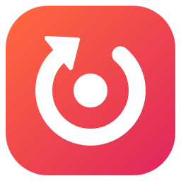
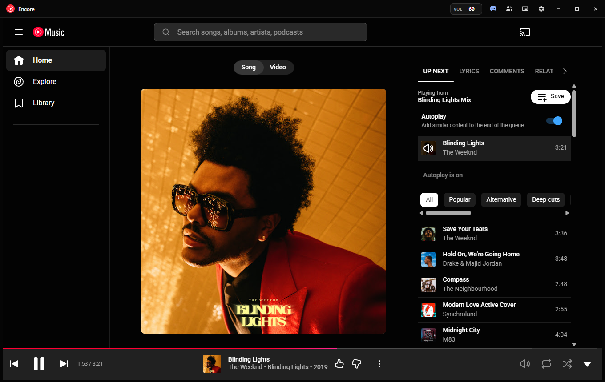

<p align="center"></p>

<h1 align="center">Encore for YouTube Music</h1>

<p align="center">A free, tiny Windows app for YouTube Music that lets you listen together with friends, even ones on Spotify.</p>

<p align="center">
  <a href="https://lilcham1.github.io/youtube-music-desktop/"><b>Download for Windows</b></a> ·
  <a href="https://github.com/lilcham1/youtube-music-desktop/releases/latest">Latest release</a> ·
  <a href="https://lilcham1.github.io/youtube-music-desktop/#faq">FAQ</a>
</p>

<p align="center"></p>

> Independent open-source project, not affiliated with or endorsed by Google, YouTube, Spotify, Discord or Last.fm. YouTube Music is a trademark of Google LLC. Encore shows the official music.youtube.com website; it doesn't download music or block ads.

Written in Go with [Wails v3](https://v3.wails.io/) on Windows' built-in WebView2 (Edge) runtime: the installer is about 4 MB and the installed app about 13 MB, where Chrome-based apps are about 100 MB.

## Features

- **Listen along**: friends with Encore hear what you play, in sync (song, position, pauses, seeks and skips); they join with a code, a link, or the button on your Discord status. End-to-end encrypted.
- **Follow a friend on Spotify**: play along with someone listening on Spotify, live through your own Discord bot (song, position, pauses and skips) or through Last.fm (song changes).
- **Spotify playlists**: paste a playlist link to play it on YouTube Music as your queue.
- **Discord status**: song, artist, artwork and a live timer, with a "Get Encore" button for friends (and "Listen along" while you host).
- **Last.fm scrobbling**, with an offline queue.
- **Mini player**: a small always-on-top window with artwork and controls.
- Playback controls everywhere: the tray menu (with the current song), the taskbar thumbnail (⏮ ⏯ ⏭), keyboard media keys and the Windows media flyout.
- Numeric `0–100` volume that remembers its level across launches; scroll over it to change it (Shift: steps of 5).
- One window with a custom dark title bar that reopens where you left it; start with Windows and minimize/close to tray if you want.
- Your official YouTube Music sign-in, library and Premium, inside the app. Links that leave YouTube Music open in your default browser.
- In-app updates from GitHub releases, verified against the published SHA-512 before installing.

## Install

Download the installer from the [download page](https://lilcham1.github.io/youtube-music-desktop/) and run it. It installs for your Windows account only (no administrator rights) and replaces earlier "YouTube Music" versions of this app, keeping your settings and sign-in.

The installer isn't code-signed yet (free signing for open-source projects has been requested), so Windows may say "Windows protected your PC": select **More info → Run anyway**. Releases are built by GitHub Actions from this repository; see the [code signing policy and privacy details](https://lilcham1.github.io/youtube-music-desktop/code-signing/).

## Requirements

- Windows 10 or 11 with the WebView2 runtime (built into Windows 11)
- Go 1.25+ to build
- Discord desktop client, only if Rich Presence is enabled

## Run locally

```powershell
go run .
```

## Build an installer

Needs [go-winres](https://github.com/tc-hib/go-winres) (`go install github.com/tc-hib/go-winres@latest`) and [NSIS](https://nsis.sourceforge.io/) (`winget install NSIS.NSIS`).

```powershell
.\build.ps1 -Version 0.2.0
```

This runs the tests, then writes `dist\Encore.exe`, `dist\Encore-Setup-0.2.0.exe` and `dist\latest.yml`. The installer is per-user, installs to `%LOCALAPPDATA%\Programs\Encore` and replaces an earlier install named "YouTube Music" (Go 0.2.x or Electron 0.1.x), whose settings in `%USERPROFILE%\.youtube-music` carry over. Pushing a `v*` tag builds and publishes a release from GitHub Actions.

## Where things live

| Path | Contents |
|---|---|
| `%USERPROFILE%\.youtube-music\settings.json` | App settings (shared with the Electron releases). Last.fm and Spotify secrets and the Discord bot token are stored encrypted with Windows DPAPI |
| `%USERPROFILE%\.youtube-music\webview2\` | YouTube sign-in and site data |
| `%USERPROFILE%\.youtube-music\app.log` | Log for troubleshooting (capped at 1 MB; the previous one is kept as `app.log.1`) |
| `main.go`, `windowstate.go` | Windows, layout, window position |
| `messages.go`, `state.go`, `playback.go` | Page messages, settings state, playback hub, tray and taskbar controls |
| `presence.go`, `internal/discord` | Discord Rich Presence (local IPC, no secret) |
| `scrobble.go`, `internal/lastfm` | Last.fm scrobbling |
| `spotifyqueue.go`, `internal/spotify`, `internal/ytmusic` | Spotify playlists played through YouTube Music |
| `listenalong.go`, `internal/listen` | Listen along (encrypted relay protocol) |
| `follower.go`, `internal/discordbot` | Following someone on Spotify (Discord bot gateway, Last.fm now playing) |
| `internal/taskbar` | Taskbar thumbnail buttons |
| `frontend/player.js` | Script injected into music.youtube.com |
| `frontend/shell.html`, `frontend/settings.html`, `frontend/mini.html` | Title bar, settings and mini player pages |
| `site/` | The listen-along join page, published with GitHub Pages |

The title bar is its own window. The YouTube Music and settings webviews are attached below it as Win32 child windows, so the site's own layout is never modified. Window moving and edge resizing are handled by the title-bar page itself (Wails' own drag/resize script only loads into pages served by its asset server, and these pages are built from strings): it asks the app to start the native move or resize. While the window is not maximised a 6 px frame of that page stays visible around the YouTube view, which is what makes the window resizable from its sides and bottom.

## Volume

The app stores the player *engine* level (`#movie_player.getVolume()`, what you actually hear) and applies it with `#movie_player.setVolume`, which exists in both of YouTube Music's current player UIs. Before playback starts it seeds YouTube's own `PREF` cookie (`volume=N`, on the old slider curve) and reloads once, so the player starts at the saved level from its first frame. If YouTube changes the level on its own it is put back; a change you make in the page (slider, keyboard) is followed and saved. The app never mutes, pauses or plays media and never writes the `<video>` element's volume.

## Tests

```powershell
go test ./...
```

Covers settings migration, the volume curve, encrypted secrets, the Discord IPC protocol (against a fake Discord) and update throttling, update verification, Last.fm signing and scrobbling rules, Spotify playlist reading, YouTube Music search parsing (against a recorded response) and matching, the Spotify queue decisions, listen-along codes, encryption and sync rules, the Discord bot gateway (against a fake gateway) and Spotify presence reading, Last.fm now-playing parsing, taskbar buttons, and invariants of the injected script (never mutes or forces playback on its own; reloads only once at startup).

Tests against the real services are opt-in:

```powershell
go test -tags live -run Live ./internal/listen/ ./internal/ytmusic/ ./internal/discordbot/
```

For a live check, start the app with a loopback debugging port, play something, and run the end-to-end script (requires Node.js):

```powershell
$env:YTM_DEBUG_PORT = 9233; go run .
node scripts\live-test.mjs
```

It verifies the starting level, title bar → page, a YouTube-initiated change being reverted, an in-page change being saved, and a track change, then restores the original level.

## Listen along

Open **Settings → Listen along → Start hosting** and share the code or link. Friends with this app paste it under *Join a friend*, open the link, or (if your Discord Rich Presence is on) click **Listen along** on your Discord status. Their player then follows yours: song, position, pauses, seeks and skips. A guest can leave at any time; when the host stops, guests are told the session ended.

Sync messages go through the public [ntfy.sh](https://ntfy.sh) relay on a random topic. Every message is AES-256-GCM encrypted with a key that only exists in the code, so the relay cannot read what you play, and messages not sealed with the room's key are ignored. Anyone you give the code to can listen until you stop hosting. The host publishes only real changes (about one message per song) to stay well within ntfy.sh's limits for anonymous use; if the relay ever rate-limits, listeners catch up a minute later. Join links use the `ytm-desktop://` link type, which the installer registers.

## Follow someone on Spotify

**Settings → Listen along → Follow someone on Spotify** plays along with a friend who listens on Spotify, even though they don't use this app. Each song they play is looked up on YouTube Music the same way as for playlists; a song that can't be found pauses until their next one. Following stops if you start hosting, join a listen-along room, or play a Spotify playlist. There are two ways:

- **Through Discord (live: song, position, pauses, seeks and skips).** Spotify shares no live listening data with other apps, but Discord shows it on a friend's status when they've connected Spotify to Discord. A regular Discord account can't read that through an API, so the app uses a Discord bot you create once: in the [Discord developer portal](https://discord.com/developers/applications) create an application, turn on **Presence Intent** and **Server Members Intent** under *Bot*, reset and copy the token into Settings, then use **Copy invite link** to add the bot to a server you share with your friends. Everyone in those servers who is playing Spotify then appears in the list with a **Follow** button. The bot only reads statuses and never sends messages; its token stays on your PC.
- **Through Last.fm (song changes only).** For a friend who scrobbles Spotify to Last.fm: enter their username (no Last.fm account or sign-in needed). Their now-playing song is checked every 10 seconds; Last.fm doesn't share position or pauses.

## Spotify playlists

**Settings → Spotify** plays a Spotify playlist on YouTube Music: each song is looked up on YouTube Music (matching title, artist and length) and the matches play in order as your queue, in groups of 50. Songs that can't be found are listed. Nothing is saved to either account.

Any public playlist works without setup: the app reads Spotify's public playlist page (the one Spotify serves for embedding players on websites), which lists up to 100 songs. For longer playlists you can add your own Spotify developer app (client credentials, no Spotify sign-in): create one at the [Spotify developer dashboard](https://developer.spotify.com/dashboard) with any name, `http://127.0.0.1:8888/callback` as redirect URI (unused) and *Web API* ticked, then copy its Client ID and secret into Settings. Spotify only serves its Web API to apps whose owner has an active **Spotify Premium** subscription; without it (or for playlists Spotify blocks for apps) the app falls back to the public page automatically and says so.

## Last.fm

**Settings → Last.fm** scrobbles what you play: a song counts after half its length or four minutes, whichever comes first (songs of 30 seconds or less never count), and Last.fm also shows what you're listening to now. Press **Connect** and approve in the browser. Scrobbles that can't be sent (offline) are queued and sent later.

Release builds include the app's own Last.fm API account, set from the `LASTFM_API_KEY` and `LASTFM_SHARED_SECRET` repository secrets at build time (as with other desktop scrobblers, a desktop app has to carry its key and secret; they identify the app, not any user). Anyone can still use their own: create a free [API account](https://www.last.fm/api/account/create) and paste its key and secret under *Use your own Last.fm API account instead*. Builds without the secrets (`go run .`, forks) ask for your own account.

## Discord Rich Presence

Select the Discord icon in the title bar and enable Rich Presence. No Discord application ID or client secret needs to be entered; the app talks only to the Discord desktop client running on the same PC.

## License

Encore is free software under the [GNU General Public License v3.0](LICENSE): you may use, share and change it, and anything you distribute based on it must be shared under the same license with its source code. Copyright © lilcham1.
